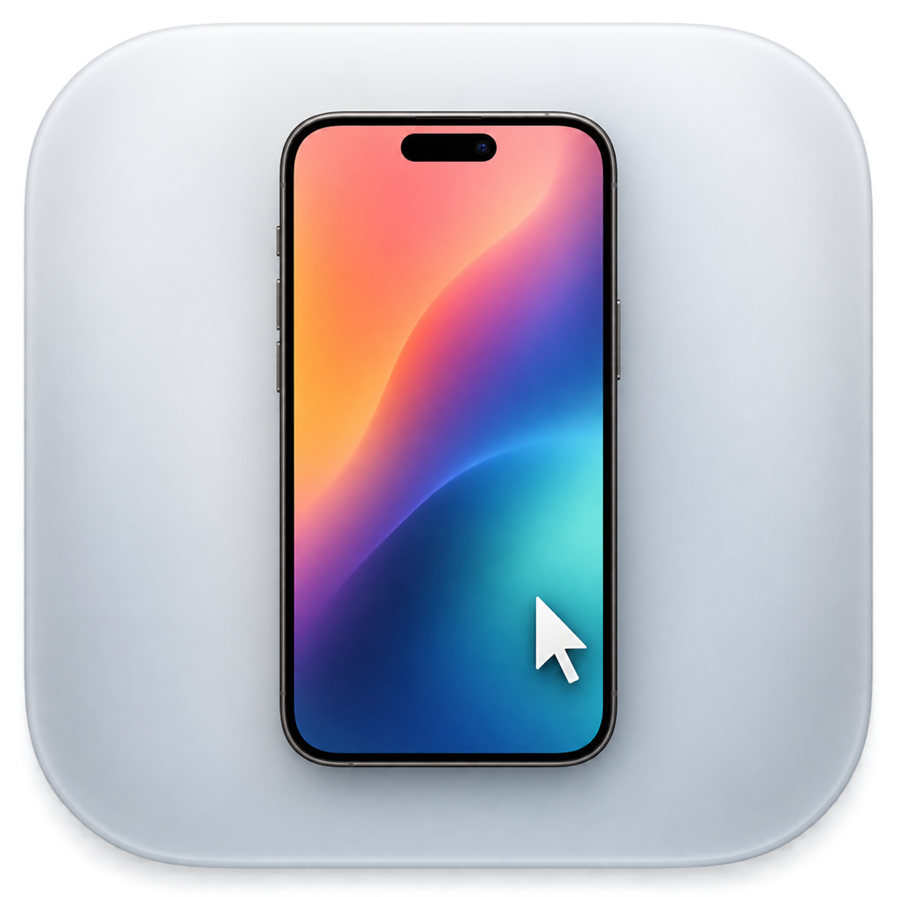

<div align="center">
  
  <h1>Mac iPhone Mirroring for EU Countries</h1>
  <p><strong>View and control an iPhone in a native, resizable Mac window.</strong></p>
  <p><code>0.1.0-alpha</code> · iOS · macOS · Apache-2.0</p>
</div>

> [!WARNING]
> This is an early experimental developer prototype, not an equivalent implementation of Apple's iPhone Mirroring. Apple's feature uses private Continuity technologies and system privileges that are unavailable to ordinary third-party apps. iOS sandbox and public-API restrictions prevent silent full-device capture, arbitrary system-wide input injection, locked-device control, and several deeply integrated features. This project instead uses a user-approved ReplayKit broadcast and a developer-signed XCTest/DeviceKit runner, so setup and performance cannot be as seamless, fluid, or reliable as Apple's implementation.

> [!CAUTION]
> The software is provided **as is**, without warranty. To the fullest extent permitted by law, Charles M. and contributors are not responsible for device problems, data loss, service interruption, bugs, or any other damage resulting from its use. Use it only on devices and networks you own or are authorized to test.

## What this project is

Mac iPhone Mirroring for EU Countries opens the iPhone display in a native macOS window and translates mouse, trackpad, and keyboard input into iPhone actions. It is primarily intended as an experimental alternative for developers and users in Europe and other regions where Apple's own iPhone Mirroring feature is not available.

```text
iPhone companion                              Mac
ReplayKit H.264  ───────────────────────────▶  native resizable window
DeviceKit input  ◀───────────────────────────  mouse + trackpad + keyboard
```

## What makes it different

| Question | Answer |
|---|---|
| Is Apple Vision Pro involved? | **No.** This repository is only for iPhone and Mac. |
| Is it aimed at European users? | Yes, especially where Apple's iPhone Mirroring is unavailable. |
| Does it use Apple's private mirroring framework? | No. It uses ReplayKit, VideoToolbox, networking, and XCTest/DeviceKit. |
| Can it control a locked iPhone? | No. The iPhone must normally remain unlocked. |
| Is it feature-identical to Apple's app? | No. Audio, notifications, private Continuity features, and native cross-device drag and drop are not implemented. |

For a Vision Pro viewer through a Mac, use **[iPhone Vision with Mac Bridge](https://github.com/charlie908/iPhone-Vision-with-Mac-Bridge)**. For a direct iPhone-to-Vision-Pro link, use **[iPhone Vision Direct](https://github.com/charlie908/iPhone-Vision-Direct)**.

## Current capabilities

- Borderless, transparent, movable, and proportionally resizable Mac window.
- iPhone-style shell with a compact Home control.
- Native low-latency H.264 decoding.
- Click to tap, drag to swipe, and click-and-hold for long press.
- Mouse-wheel and trackpad scrolling, including horizontal two-finger gestures.
- Batched Mac keyboard input.
- `⌘1` Home, `⌘2` App Switcher, and `⌘3` iPhone Spotlight.
- `⌘+`, `⌘0`, and `⌘−` window sizing.
- Keep-awake assistance during an active stream.
- Dedicated Bonjour service (`_iphonemac._tcp`) and DeviceKit port `12005`.

## Requirements

- A Mac with a recent Xcode and Xcode command-line tools.
- An iPhone with Developer Mode enabled and paired with the Mac.
- Your own Apple Developer account and unique signing identifiers.
- XcodeGen only if you regenerate the macOS project.

## Repository layout

```text
ios/       iPhone companion app and ReplayKit extension
macos/     native Mac viewer and dedicated DeviceKit control project
assets/    repository artwork
```

## Install

### 1. Configure signing

Replace every `YOURTEAMID` and `com.example` placeholder with values owned by your Apple Developer account. Configure the iPhone app, ReplayKit extension, matching App Group, Mac target, and DeviceKit test targets. No certificate, provisioning profile, Apple team identifier, device identifier, or private network address from the original setup is included.

### 2. Configure the development iPhone

Enter the identifiers for your paired device in `macos/iPhoneMac/DeviceKitLauncher.swift`:

- `YOUR_IPHONE_DESTINATION_ID`, used by `xcodebuild`;
- `YOUR_IPHONE_CORE_DEVICE_ID`, used by `xcrun devicectl`.

Discover them with:

```bash
xcrun xctrace list devices
xcrun devicectl list devices
```

Also update the companion-app bundle identifier and the configured Xcode path if your installation is not `/Applications/Xcode-beta.app`.

### 3. Build

1. Open `ios/BroadcastApp.xcodeproj`, sign both iPhone targets, and install the companion app.
2. Open `macos/iPhoneMac.xcodeproj`, configure signing, and build the Mac app.
3. If you edit `macos/project.yml`, run `xcodegen generate` before rebuilding.

## Start a session

1. Unlock and pair the iPhone with the Mac.
2. Open Mac iPhone Mirroring for EU Countries on the Mac.
3. The Mac app attempts to start its dedicated DeviceKit runner and open the companion app.
4. On the iPhone, use the ReplayKit sheet and explicitly confirm **Start Broadcast**.

ReplayKit confirmation cannot be automated by a normal third-party application.

## Comparison with Apple's iPhone Mirroring

| Capability | This prototype |
|---|---|
| Tap, long press, swipe, scroll, and keyboard | Available |
| Movable and resizable phone window | Available |
| Home, App Switcher, and Spotlight shortcuts | Available |
| Audio routed to the Mac | Not implemented |
| Automatic landscape shell rotation | Not finished |
| Native cross-device drag and drop | Not available through the chosen public APIs |
| Mirrored iPhone notifications in macOS | Not available through the chosen public APIs |
| Control while the iPhone remains locked | Not available; XCTest requires an unlocked device |
| Apple's private Continuity trust and pairing | Not available |

## Security and limitations

The local protocol has no application-level authentication or encryption. Use it only with a trusted Mac, iPhone, and network. DRM-protected content may appear black. XCTest behavior can change between Xcode/iOS releases, and automatic startup currently requires device-specific configuration.

Read [SECURITY.md](SECURITY.md) before use.

## Project status and contributions

This is version `0.1.0-alpha`: a working first draft, not production software. I am not a professional software developer; I created this experiment after Apple's mirroring feature remained unavailable in my region. There is still substantial work to improve setup, security, reliability, latency, audio, rotation, compatibility, and accessibility.

Contributions, testing, documentation fixes, and constructive code review are more than welcome. Please read [CONTRIBUTING.md](CONTRIBUTING.md).

## Credits

Original prototype by **Charles M.** See [NOTICE](NOTICE) and [THIRD-PARTY-NOTICES.md](THIRD-PARTY-NOTICES.md).

This independent project is not affiliated with or endorsed by Apple Inc. It does not bypass regional availability of Apple's application; it is a separate developer prototype built with a different technical approach. Apple, iPhone, Mac, iOS, macOS, ReplayKit, and Xcode are trademarks of Apple Inc.
